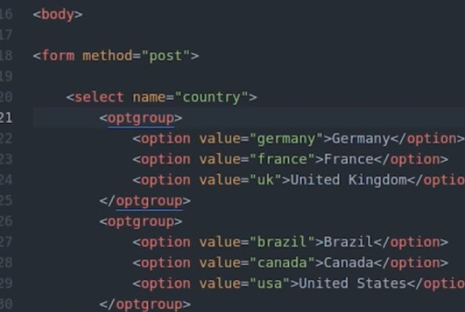

# forms

## قسمت اول

- ساخت فرم ساده و ارسال با گت و نمایش آرایه گت با ور دامپ

## قسمت دوم

- تفاوت های روش ارسال پوست و گت در امنیت و عدم نمایش در نوار آدرس
- گت محدودیت حجم اطلاعات ارسالی دارد
- پوست نمی تواند بوک مارک کند چون چیزی در نوار آدرس دیده نخواهد شد
- با یک شرط که اگر از آرایه پوست استفاده شده است در هنگام پردازش می توان جلوی خروجی اولیه را گرفت

```php
if($_SERVER["REQUEST_METHOD"] == "POST")
```

- برنامه منتظر می ماند تا فرم ارسال شود تا دستورات داخل بلاک این شرط اجرا شود

## قسمت چهار و پنج

- توضیح انواع ورودی های فرم و ویژگی های نام و مقدار برای آنها

## قسمت شش

- درباره ورودی متنی بلند textarea که به صورت تگ باز و بسته است

## قسمت هفتم

- درباره لیست select 