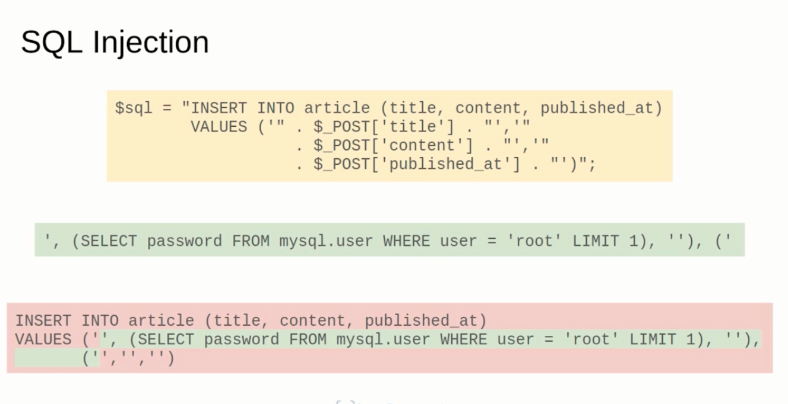

# 📘 جزوه: جلوگیری از SQL Injection در PHP

## 🎯 هدف درس

در این درس یاد می‌گیریم چرا استفادهٔ مستقیم از داده‌های فرم در دستورات SQL خطرناک است و چطور با استفاده از روش‌های ایمن‌تر از نفوذ SQL (SQL Injection) جلوگیری کنیم.

---

## 🧩 بررسی کد اولیه

در مثال زیر داده‌های ارسال‌شده از فرم مستقیماً وارد دستور SQL شده‌اند:

```php
<?php
if ($_SERVER["REQUEST_METHOD"] == "POST") {

    require 'includes/database.php';

    $sql = "INSERT INTO article (title, content, published_at)
            VALUES ('" . $_POST['title'] . "','"
                       . $_POST['content'] . "','"
                       . $_POST['published_at'] . "')";

    $results = mysqli_query($conn, $sql);

    if ($results === false) {
        echo mysqli_error($conn);
    } else {
        var_dump($sql);
        $id = mysqli_insert_id($conn);
        echo "Inserted record with ID: $id";
    }
}
?>
```

این روش در ظاهر کار می‌کند اما **بسیار خطرناک است** زیرا کاربر می‌تواند در فیلدهای فرم هر متنی حتی دستورات SQL بنویسد.

---

## ⚠️ مشکل اصلی: SQL Injection

وقتی داده‌های ورودی بدون بررسی وارد SQL می‌شوند، ممکن است باعث شوند بخش جدیدی از SQL اجرا شود. مثلاً:

```text
' OR 1=1; --
```

اگر چنین مقداری در فیلد `title` وارد شود، کل کوئری تغییر کرده و حتی ممکن است اطلاعات حساس از جدول‌های دیگر خوانده شود.

---

## 🧠 مثال عملی (بر اساس ویدیو)

در ویدیو دیدیم که فقط با وارد کردن یک `'` (تک‌کوتیشن) خطای Syntax رخ می‌دهد، چون کوئری به شکل زیر درمی‌آید:

```sql
INSERT INTO article (title, content, published_at)
VALUES ('O'Reilly', '', '')
```

این باعث می‌شود SQL شکسته شود چون `'O'` به عنوان رشته بسته شده و بقیه به عنوان کد SQL تفسیر می‌شود.

با کمی تغییر در ورودی، حتی می‌توان دستور SQL دیگری را به انتهای آن اضافه کرد و داده‌های حساس را از پایگاه داده استخراج کرد.

---

## 💣 مفهوم SQL Injection

SQL Injection یعنی: *تزریق کد SQL توسط کاربر در فیلد ورودی برای تغییر یا کنترل دستورات پایگاه داده.*

در مثال ویدیو، مهاجم توانست با وارد کردن دستور خاصی در فیلد `title`، رمز هش‌شده‌ی کاربر root را از جدول `user` پایگاه داده `mysql` استخراج کند.



---

## 🔐 روش‌های جلوگیری از SQL Injection

### 1. استفاده از **Prepared Statements**

روش امن‌تر استفاده از دستورات آماده (Prepared Statements) در `MySQLi` یا `PDO` است:

```php
<?php
if ($_SERVER["REQUEST_METHOD"] == "POST") {

    require 'includes/database.php';

    $sql = "INSERT INTO article (title, content, published_at)
            VALUES (?, ?, ?)";

    $stmt = mysqli_prepare($conn, $sql);
    mysqli_stmt_bind_param($stmt, "sss", $_POST['title'], $_POST['content'], $_POST['published_at']);

    if (mysqli_stmt_execute($stmt)) {
        echo "Record inserted successfully!";
    } else {
        echo mysqli_error($conn);
    }

    mysqli_stmt_close($stmt);
}
?>
```

🔹 در این روش، مقادیر ابتدا به‌صورت جداگانه ارسال می‌شوند و هیچ‌وقت به شکل مستقیم در رشته SQL قرار نمی‌گیرند.
🔹 این کار باعث می‌شود حتی اگر کاربر کد SQL وارد کند، فقط به عنوان داده در نظر گرفته شود.

---

### 2. اعتبارسنجی داده‌ها (Validation)

قبل از درج در پایگاه داده، نوع و فرمت ورودی‌ها را بررسی کنید:

```php
$title = trim($_POST['title']);
if (empty($title)) {
    echo "Title cannot be empty.";
}
```

---

## 🧾 فرم HTML نمونه

```html
<h2>New article</h2>

<form method="post">
    <div>
        <label for="title">Title</label>
        <input name="title" id="title" placeholder="Article title">
    </div>

    <div>
        <label for="content">Content</label>
        <textarea name="content" rows="4" cols="40" id="content" placeholder="Article content"></textarea>
    </div>

    <div>
        <label for="published_at">Publication date and time</label>
        <input type="datetime-local" name="published_at" id="published_at">
    </div>

    <button>Add</button>
</form>
```

---

## 🧮 تمرین‌ها

1. کد اولیهٔ ناامن را بررسی کن و توضیح بده چرا SQL Injection در آن ممکن است.
2. همان برنامه را با استفاده از Prepared Statement بازنویسی کن.
3. خطایی را که در صورت وارد کردن `'` در عنوان اتفاق می‌افتد، شبیه‌سازی کن.
4. بررسی کن که آیا ورود کاراکترهای خاص مانند `;` و `--` تاثیری در اجرای کد دارند یا نه.
5. به عنوان تمرین پیشرفته، بررسی کن تفاوت `mysqli` و `PDO` در استفاده از Prepared Statement چیست.

---

✅ **نتیجه‌گیری:**
استفاده از Prepared Statement و اعتبارسنجی ورودی‌ها، از خطرناک‌ترین نوع حمله یعنی SQL Injection جلوگیری می‌کند.
